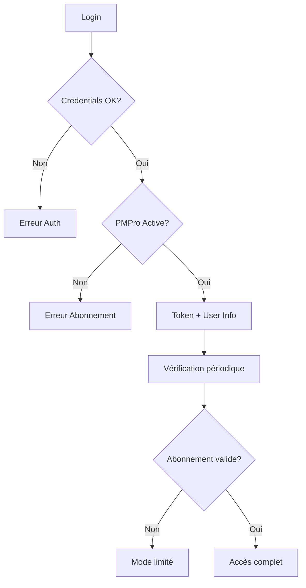

# Checklist d'Implémentation - LearnPress Offline

## ✅ Fichiers Créés

### 1. **Backend Electron**
- [x] `lib/api-client.js` - Client API WordPress avec support PMPro
- [x] `lib/database.js` - Base de données SQLite sécurisée
- [x] `scripts/notarize.js` - Script de notarisation macOS
- [x] `config/index.js` - Configuration centralisée

### 2. **Documentation**
- [x] `wordpress-plugin/README.md` - Guide d'installation du plugin
- [x] Guide de corrections dans `corrections-guide.md`

### 3. **Tests**
- [x] `tests/auth.test.js` - Tests unitaires corrigés

## 🔧 Modifications Nécessaires

### 1. **Cohérence API**
- [ ] Remplacer toutes les références `col-lp/v1` par `col-lms/v1`
- [ ] Aligner les endpoints entre le plugin WordPress et l'app

### 2. **Package.json**
```json
{
  "dependencies": {
    // Ajouter :
    "form-data": "^4.0.0"
  },
  "scripts": {
    // Ajouter :
    "rebuild-sqlite3": "electron-rebuild -f -w better-sqlite3",
    "postinstall": "electron-builder install-app-deps && npm run rebuild-sqlite3"
  }
}
```

### 3. **Structure des dossiers**
```
learnpress-offline-app/
├── config/              # NOUVEAU
│   └── index.js        # Configuration centralisée
├── lib/
│   ├── api-client.js   # CRÉÉ
│   ├── database.js     # CRÉÉ
│   ├── encryption.js   # Existant
│   └── ipc-handlers.js # Existant
└── scripts/
    ├── notarize.js     # CRÉÉ
    └── dev-utils.js    # Existant
```

## 🔒 Intégration Paid Memberships Pro

### 1. **Côté WordPress**
- Le plugin vérifie l'abonnement à la connexion
- Restreint l'accès aux cours selon le niveau
- Retourne les infos d'abonnement dans l'API

### 2. **Côté Application**
- Gestion des erreurs `no_membership`
- Affichage du statut d'abonnement
- Limitation des fonctionnalités selon le niveau
- Vérification périodique de l'abonnement

### 3. **Flux d'authentification**


## 🚀 Étapes de Déploiement

### 1. **Préparation**
```bash
# Installer les dépendances
npm install

# Créer le fichier .env
cp .env.example .env
# Éditer .env avec vos valeurs

# Rebuild SQLite pour Electron
npm run rebuild-sqlite3
```

### 2. **Tests**
```bash
# Tests unitaires
npm test

# Test de l'app en dev
npm run dev

# Test du plugin WordPress
# Utiliser Postman avec les endpoints documentés
```

### 3. **Build**
```bash
# Windows
npm run build-win

# macOS (nécessite les certificats Apple)
npm run build-mac

# Linux
npm run build-linux
```

### 4. **WordPress**
1. Installer LearnPress et Paid Memberships Pro
2. Configurer les niveaux d'abonnement
3. Installer le plugin COL LMS Offline API
4. Configurer HTTPS (obligatoire)
5. Tester les endpoints API

## 📊 Monitoring en Production

### 1. **Logs à surveiller**
- App : `~/AppData/Roaming/learnpress-offline/logs/` (Windows)
- WordPress : `/wp-content/debug.log`
- Serveur : Logs Apache/Nginx pour les erreurs API

### 2. **Métriques importantes**
- Taux de réussite des connexions
- Temps de téléchargement des cours
- Taux de synchronisation réussie
- Utilisation de l'espace disque

### 3. **Alertes recommandées**
- Échec de connexion > 10% des tentatives
- Espace disque < 1GB
- Token expiré sans refresh réussi
- Abonnement expirant dans 7 jours

## 🐛 Problèmes Connus et Solutions

### 1. **"SQLITE_CORRUPT"**
- Cause : Base de données corrompue
- Solution : Implémenter backup automatique quotidien

### 2. **Téléchargement lent**
- Cause : Fichiers volumineux non optimisés
- Solution : Compression côté serveur + CDN

### 3. **Synchronisation échouée**
- Cause : Token expiré ou connexion instable
- Solution : File de synchronisation persistante

## 📈 Améliorations Futures

1. **Support multi-comptes**
   - Permettre plusieurs connexions WordPress
   - Switcher entre les comptes

2. **Mode collaboratif**
   - Partage de notes entre étudiants
   - Forums de discussion offline

3. **Analytics avancés**
   - Temps passé par leçon
   - Taux de complétion
   - Export des statistiques

4. **Intégrations**
   - Zoom pour cours en direct
   - Google Calendar pour planning
   - Notifications push

## 📞 Support

- **Documentation technique** : `/docs/API.md`
- **Guide utilisateur** : `/docs/USER_GUIDE.md`
- **Issues GitHub** : [github.com/votre-repo/issues](https://github.com/votre-repo/issues)
- **Email** : support@votre-site.com

---

**Version** : 1.0.0  
**Dernière mise à jour** : Janvier 2024  
**Mainteneur** : Équipe LearnPress Offline